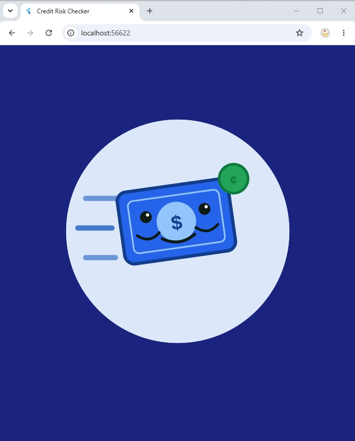
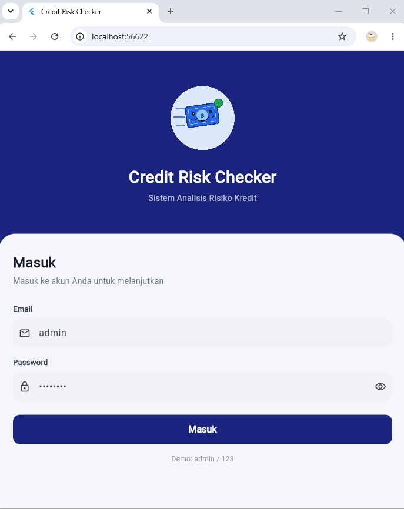
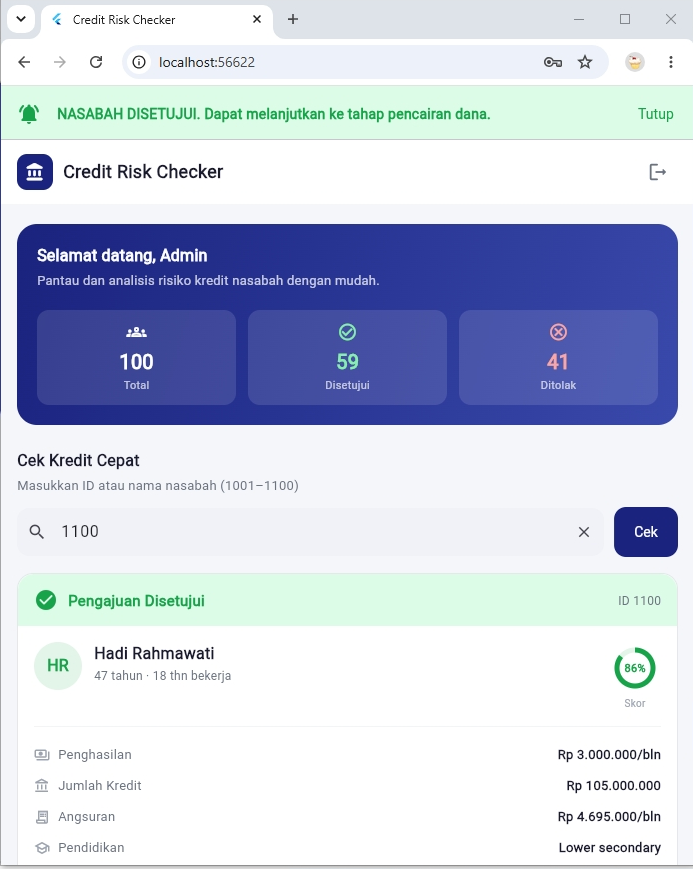
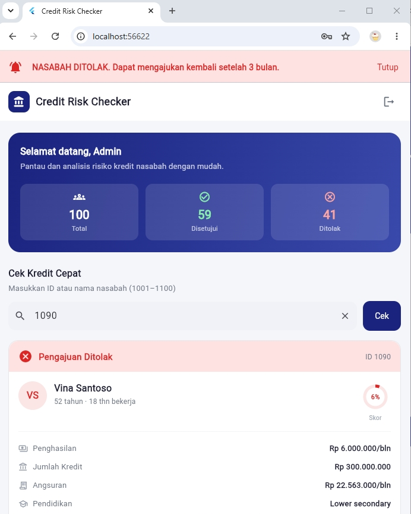

# credit_risk_v1

Aplikasi Flutter digunakan oleh staff perusahaan pembiayaan/kredit (loan officer, credit analyst, admin) untuk menganalisis risiko kredit nasabah, dengan dukungan fitur tambahan berupa notifikasi status pengajuan diterima / ditolak. 

Aplikasi dapat di lihat melalui web browser Chrome/Edge/Safari di https://credit-risk-checker-v1.web.app/.
Untuk login dapat mengisi :
**Email     :  Admin**
**Password  :  123**

Untuk melakukan Cek Kredit Cepat dapat memasukkan **ID nasabah** (Contoh: **1004**) atau **nama** (Contoh. **Sari**) lalu klik tombol **Cek**.

# Credit Risk Checker v0.2.0

Aplikasi Flutter untuk menganalisis risiko kredit nasabah. Mencakup **halaman login**, **halaman utama**, **fitur Quick Credit Check**, serta **sistem notifikasi 3 kanal** (in-app banner, local notification, dan push notification via Firebase Cloud Messaging).

---

## Tampilan Layar


<table>
  <tr>
    <td align="center"><b>Splash</b></td>
    <td align="center"><b>Login</b></td>
    <td align="center"><b>Notifikasi Disetujui</b></td>
    <td align="center"><b>Notifikasi Ditolak</b></td>
  </tr>
  <tr>
    <td></td>
    <td></td>
    <td></td>
    <td></td>
  </tr>
</table>


Saat status pengajuan diketahui, banner notifikasi muncul di bagian atas halaman (hijau untuk disetujui, merah untuk ditolak) dan tetap tampil sampai pengguna menekan tombol **Tutup**.

---

## Struktur Folder

```
lib/
├── main.dart                          # Entry point, inisialisasi Firebase & notifikasi, tema aplikasi
├── data/
│   └── sample_data.dart               # 100 data nasabah demo (ID 1001–1100)
├── pages/
│   ├── login_page.dart                # Halaman login
│   └── home_page.dart                 # Halaman utama + Quick Check + in-app banner
│   └── splash_page.dart               # Tampilan pembuka dengan animasi logo bergerak
├── services/
│   ├── notification_service.dart      # Wrapper flutter_local_notifications (Android/iOS)
│   └── push_notification_service.dart # Wrapper Firebase Cloud Messaging (semua platform)
└── utils/
    ├── formatters.dart                # Helper format Rupiah & persen
    └── next_step_message.dart         # Pesan "langkah berikutnya" (dipakai di 3 kanal notifikasi)

web/
└── firebase-messaging-sw.js           # Service worker untuk push notification saat tab di-background
```

---

## Fitur

### 1. Halaman Login (`login_page.dart`)
- Form email + password dengan validasi.
- Toggle tampilkan/sembunyikan password.
- Pesan error inline saat login gagal.
- Loading state saat proses autentikasi.
- **Kredensial demo:** `admin` / `123`

### 2. Halaman Utama (`home_page.dart`)
- Top bar dengan nama aplikasi dan tombol logout.
- Kartu selamat datang bergradien dengan statistik dataset (total, disetujui, ditolak).

### 3. Quick Credit Check
- Input pencarian berdasarkan **ID nasabah** (mis. `1004`) atau **nama** (mis. `Sari`).
- Loading state saat pencarian berlangsung.
- Kartu hasil menampilkan:
  - Status keputusan (✅ Disetujui / ❌ Ditolak) dengan warna kode.
  - Skor risiko dalam gauge lingkaran (berdasarkan `EXT_SOURCE_3`).
  - Detail: penghasilan, jumlah kredit, angsuran, pendidikan.
- Tampilan khusus saat data tidak ditemukan.
- Tombol clear untuk reset pencarian.

### 4. Notifikasi "Langkah Berikutnya"
Begitu status pengajuan (disetujui/ditolak) diketahui, 3 kanal notifikasi terpicu sekaligus:

| Kanal | Kapan muncul | Platform |
|---|---|---|
| **In-app banner** | Langsung, saat user aktif di aplikasi | Semua platform |
| **Local notification** | Tetap muncul walau app di-minimize/background | Android, iOS (tidak tersedia di web) |
| **Push notification (FCM)** | Dipicu dari server saat keputusan kredit dibuat, sampai saat app ditutup sepenuhnya | Android, iOS, Web |

Isi pesan untuk ketiga kanal diambil dari sumber yang sama (`utils/next_step_message.dart`). Banner in-app hanya tertutup lewat tombol **Tutup**.

---

## Konfigurasi Firebase

Project ini menggunakan Firebase Cloud Messaging untuk push notification. Sebelum menjalankan:

1. Jalankan `flutterfire configure` di root project agar `lib/firebase_options.dart` ter-generate sesuai project Firebase ini.
2. Pastikan `web/firebase-messaging-sw.js` memakai config **yang sama persis** dengan `DefaultFirebaseOptions.web` di `firebase_options.dart`.
3. Untuk web, dapatkan **VAPID key** dari Firebase Console → Project Settings → Cloud Messaging → Web configuration, lalu isi di `push_notification_service.dart`.
4. Kirim `fcmToken` (lihat `PushNotificationService.instance.fcmToken`) ke backend Anda, dikaitkan dengan `SK_ID_CURR` nasabah, agar backend tahu ke device mana push harus dikirim saat keputusan kredit dibuat.

### Catatan kompatibilitas Web
- `flutter_local_notifications` **tidak mendukung platform web** — inisialisasinya dilewati otomatis (`kIsWeb` check) agar tidak memblokir `runApp()`.
- Permintaan izin notifikasi browser (`requestPermission()`) dibungkus `timeout()` 5 detik, untuk menghindari aplikasi macet di browser yang tidak menampilkan dialog izin (mis. karena sudah ada keputusan permission tersimpan sebelumnya).
- `firebase-messaging-sw.js` menggunakan `self.skipWaiting()` dan `clients.claim()` agar service worker versi baru langsung aktif, menghindari konflik dengan service worker lama yang tersimpan di cache browser.

---

## Cara Menjalankan

```bash
# 1. Install dependencies
flutter pub get

# 2. (Sekali saja) Konfigurasi Firebase
flutterfire configure

# 3. Jalankan di device/emulator
flutter run

# atau khusus web
flutter run -d chrome
```

### Persyaratan
- Flutter SDK ^3.12.0
- Dart SDK ^3.12.0
- Project Firebase aktif (Cloud Messaging enabled)

### Dependencies utama
- `flutter_local_notifications: ^21.0.0`
- `firebase_core: ^4.11.0`
- `firebase_messaging: ^16.3.0`

---

## Rencana Pengembangan (Roadmap)

| Versi | Fitur |
|-------|-------|
| v0.1.0 | Login, Home, Quick Credit Check |
| v0.2.0 (sekarang) | Notifikasi 3 kanal (in-app, local, push FCM) |
| v0.3.0 | Daftar nasabah lengkap + filter |
| v0.4.0 | Halaman detail nasabah |
| v1.0.0 | Integrasi real API + autentikasi JWT + registrasi token FCM ke backend |

---

## Catatan
- Data yang digunakan bersifat **simulasi** (100 nasabah demo, ID 1001–1100).
- Autentikasi saat ini hanya untuk demo; ganti **Kredensial demo:** `admin` / `123`.
- Backend untuk mengirim push notification (Cloud Function/server) **belum termasuk** di repo ini — lihat bagian Konfigurasi Firebase di atas untuk langkah integrasinya.


#### Dibuat oleh Sentot Ali Basah