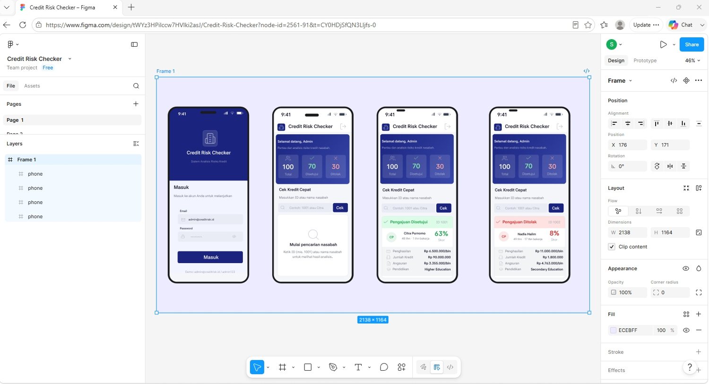

# credit_risk_v1

A new Flutter project.

[text](demo.png)

# Credit Risk Checker v0.1.0

Aplikasi Flutter untuk menganalisis risiko kredit nasabah. Versi awal ini mencakup **halaman login**, **halaman utama**, dan **fitur Quick Credit Check**.

---
## Desain Figma




## Tampilan Layar

```
┌─────────────────────────┐   ┌─────────────────────────┐
│  🏦  KreditKu           │   │  🏦  KreditKu      [→]  │
│                         │   ├─────────────────────────┤
│  ┌─────────────────┐    │   │  Selamat datang, Admin  │
│  │  [ikon bank]    │    │   │  ┌───────────────────┐  │
│  │  KreditKu       │    │   │  │ 100 | 70✓ | 30✗   │  │
│  │  Analisis Kredit│    │   │  └───────────────────┘  │
│  └─────────────────┘    │   │                         │
│                         │   │  Cek Kredit Cepat       │
│  Masuk                  │   │  ┌──────────────┐[Cek]  │
│  ──────────────────     │   │  │  ID / Nama   │       │
│  Email                  │   │  └──────────────┘       │
│  [________________]     │   │                         │
│                         │   │  ┌───────────────────┐  │
│  Password               │   │  │ ✅ Disetujui       │  │
│  [____________][👁]     │   │  │ Citra Purnomo      │  │
│                         │   │  │ 48 thn · 1 thn krj │  │
│  [    Masuk    ]        │   │  │ Income: Rp 6.5 jt  │  │
│                         │   │  │ Kredit: Rp 90 jt   │  │
│  demo: admin@… /admin123│   │  └───────────────────┘  │
└─────────────────────────┘   └─────────────────────────┘
      Login Page                     Home Page
```

---

## Struktur Folder

```
lib/
├── main.dart                   # Entry point & tema aplikasi
├── data/
│   └── sample_data.dart        # 100 data nasabah demo
├── pages/
│   ├── login_page.dart         # Halaman login
│   └── home_page.dart          # Halaman utama + Quick Check
└── utils/
    └── formatters.dart         # Helper format Rupiah & persen
```

---

## Fitur v0.1.0

### 1. Halaman Login (`login_page.dart`)
- Form email + password dengan validasi.
- Toggle tampilkan/sembunyikan password.
- Pesan error inline saat login gagal.
- Loading state saat proses autentikasi.
- **Kredensial demo:** `admin@kreditku.id` / `admin123`

### 2. Halaman Utama (`home_page.dart`)
- Top bar dengan nama aplikasi dan tombol logout.
- Kartu selamat datang bergradien dengan statistik dataset (total, disetujui, ditolak).

### 3. Fitur: Quick Credit Check
- Input pencarian berdasarkan **ID nasabah** (mis. `1001`) atau **nama** (mis. `Citra`).
- Loading state saat pencarian berlangsung.
- Kartu hasil menampilkan:
  - Status keputusan (✅ Disetujui / ❌ Ditolak) dengan warna kode.
  - Skor risiko dalam gauge lingkaran (berdasarkan `EXT_SOURCE_3`).
  - Detail: penghasilan, jumlah kredit, angsuran, pendidikan.
- Tampilan khusus saat data tidak ditemukan.
- Tombol clear untuk reset pencarian.

---

## Cara Menjalankan

```bash
# 1. Clone / salin folder ini ke proyek Flutter baru
flutter create credit_risk_checker
# Lalu salin seluruh isi lib/ di atas ke lib/ proyek baru

# 2. Install dependencies
flutter pub get

# 3. Jalankan di emulator / device
flutter run
```

### Persyaratan
- Flutter SDK ≥ 3.0.0
- Dart SDK ≥ 3.0.0

---

## Rencana Pengembangan (Roadmap)

| Versi | Fitur |
|-------|-------|
| v0.1.0 (sekarang) | Login, Home, Quick Credit Check |
| v0.2.0 | Daftar nasabah lengkap + filter |
| v0.3.0 | Halaman detail nasabah |
| v1.0.0 | Integrasi API nyata + autentikasi JWT |

---

## Catatan
- Data yang digunakan bersifat **simulasi** (100 nasabah demo, ID 1001–1100).
- Autentikasi saat ini hanya untuk demo; ganti dengan backend nyata sebelum produksi.
- Tidak ada dependency pihak ketiga — hanya paket Flutter bawaan.
